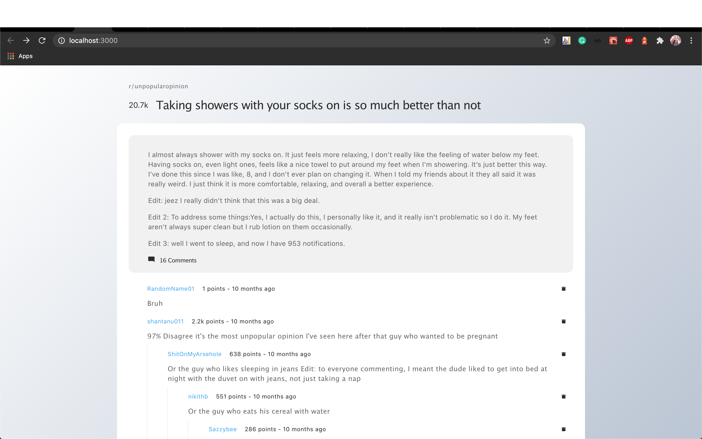

# React Reddit Dashboard

Reddit post dashboard app<br />

## Demo
Link to Demo App: https://sooryasoorya.github.io/react-reddit-dashboard/

## How to Load the App

The project uses Node.js and the [Create React App](https://github.com/facebook/create-react-app) starter. If you do not have Node >= 6.x installed, you can download it here: [Node.js](https://nodejs.org/en/)

Once Node is installed, navigate to the directory where you want to store the app run commands:
```
git clone https://github.com/SooryaSoorya/react-reddit-dashboard.git

npm install
```
Once all of the dependencies have been installed successfully from the project directory you can launch the app with
```
npm start
```

A new browser window should automatically open displaying the app. If it doesn't, navigate to [http://localhost:3000/](http://localhost:3000/) in your browser



The page will reload if you make edits.<br />
You will also see any lint errors in the console. <br/>

Launche the test runner in the interactive watch mode with <br />
```
npm test
```
See the section about [running tests](https://facebook.github.io/create-react-app/docs/running-tests) for more information.

Builds the app for production to the `build` folder with<br />
```
npm run build
```
It correctly bundles React in production mode and optimizes the build for the best performance.
The build is minified and the filenames include the hashes.<br />
Your app is ready to be deployed!!

## App Description

- Contains  post-header, post-content, comment, and comment-list components in src folder
- There's service , utils, styles, assets and mock data in different folders
- Have used [gh-pages](https://github.com/tschaub/gh-pages) to deploy the app

## Improvisation Ideas

 - Currently, when the data is being retrieved from the backend nothing is showing in the UI, we can add a loader image
 - For actions like deleting comment can display a notification when the it is done
 - Comments Tree Hierarchy, open and close actions for them can be implemented
 
## References

You can learn more in the [Create React App documentation](https://facebook.github.io/create-react-app/docs/getting-started).<br/>
React hooks [React hooks](https://reactjs.org/docs/hooks-intro.html). <br/>
To learn React, check out the [React documentation](https://reactjs.org/).

Happy coding..
